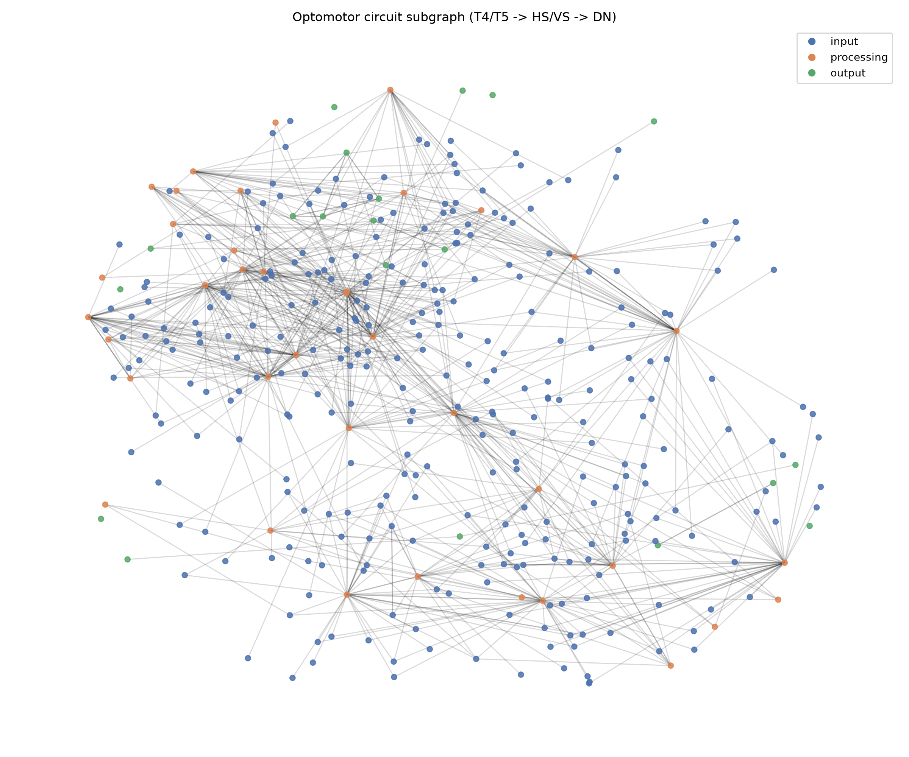
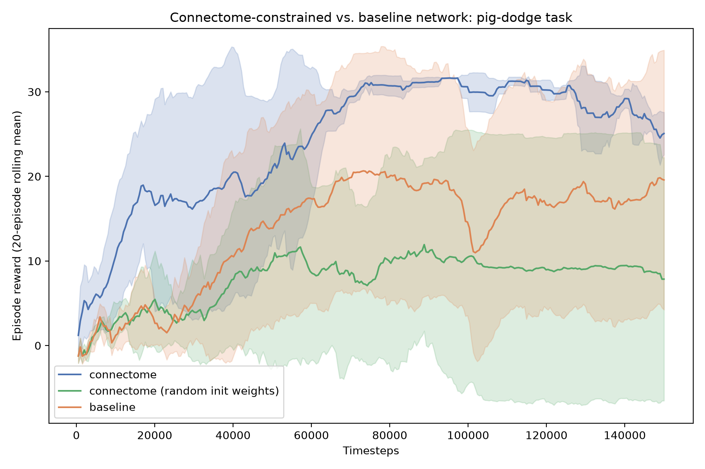
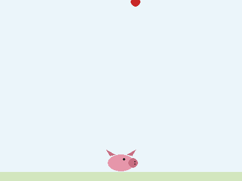
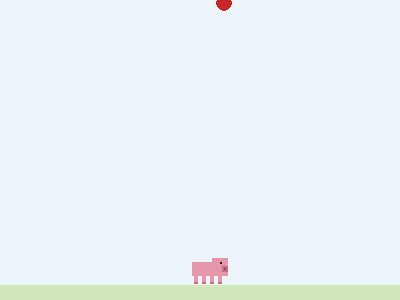
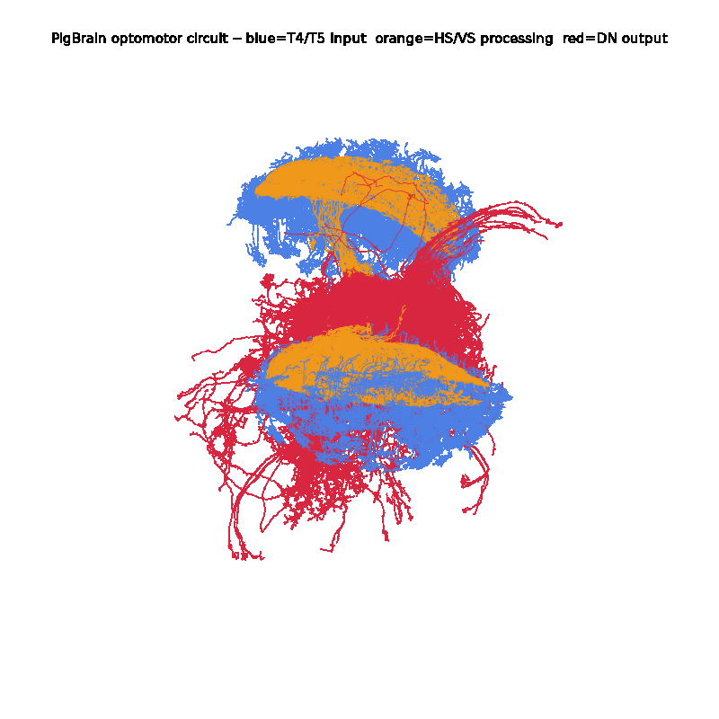
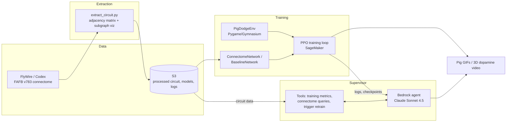

# PigBrain

A reinforcement learning agent whose neural network topology is built from a
real, published circuit in the female fruit fly connectome ([FlyWire](https://flywire.ai/),
FAFB v783), trained via PPO on a toy 2D dodging task, visualized as a pig
sprite. A Bedrock agent supervises training and can answer questions about
the underlying biology.

## Hypothesis

Does a network shaped like a real fly visual/optomotor circuit (T4/T5 →
HS/VS → descending neurons) learn a simple steering task faster or better
than a same-sized, same-edge-count, randomly-rewired network?

## Result (honest, up front)

On a pig-dodge task where a pointed dripstone is thrown at the pig, across
two independent runs (laptop, then SageMaker — 6 seeds per variant):

- The connectome-constrained network **learned on 6/6 seeds**; the size- and
  edge-matched random network learned on **4/6**.
- It learned **~1.5× faster** (median ~26k timesteps to a rolling reward of
  25, vs. ~41k for the baseline), with a wide spread.
- **The wiring alone doesn't explain it.** An ablation with the real wiring
  but *random* initial weights learned on only 1/3 seeds — worse than the
  random baseline. The real synapse *strengths*, used as initial weights,
  carry most of the benefit.

That said:

- Among runs that *did* converge, final performance is similar and every
  variant ends up with the same "always step away" policy.
- **6 seeds (3 for the ablation) is limited statistical power.** The
  reliability gap could still be luck.
- **Same seeds gave different trajectories on different hardware** — RL
  runs aren't bitwise reproducible across CPUs, which is why the first run's
  tight numbers (31.6 ± 0.1) were misleadingly precise.
- **v1 of this experiment was flawed and is kept for transparency:** with
  uniformly random ball spawns, every trained pig learned to hide in a corner
  instead of dodging. The task was fixed and everything re-run.

Full writeup, including the v1 → v2 → v3 story: [`results/PHASE3_RESULTS.md`](results/PHASE3_RESULTS.md).

**The RL agent is the part that is genuinely self-learning.** The Bedrock
layer described below is an automated training *supervisor* — it makes
decisions about the training process by calling tools that read real data,
but it does not itself learn over time.

## Visuals

| Circuit topology | Reward comparison (SageMaker run, 3 variants) |
|---|---|
|  |  |

| Untrained pig (random policy) | Trained pig (connectome-constrained) |
|---|---|
|  |  |

**Bonus: the real circuit in 3D.** Rendered from the actual FlyWire neuron
skeletons (not an abstract graph) — 631 real T4/T5, HS/VS, and DN neurons
from our extracted circuit, colored by role:



## Architecture



| Component | Service |
|---|---|
| Processed connectome data, models, logs | S3 — mirrored with [`oink/s3.py`](oink/s3.py) |
| Circuit topology extraction | [`scripts/extract_circuit.py`](scripts/extract_circuit.py) |
| RL training (pig environment) | SageMaker training jobs — [`scripts/sagemaker_train.py`](scripts/sagemaker_train.py) → [`oink/sagemaker_entry.py`](oink/sagemaker_entry.py) (also runs locally via [`oink/train.py`](oink/train.py)) |
| Training supervisor / Q&A agent | Bedrock ([`oink/supervisor/`](oink/supervisor/)) |

The v3 comparison (9 jobs: 3 variants × 3 seeds) was trained on SageMaker
`ml.m5.xlarge` instances in ap-south-1, ~2.5 h each, launched with one
command:

```bash
python scripts/sagemaker_train.py launch --variant connectome baseline connectome_randinit --seed 0 1 2
python scripts/sagemaker_train.py status
python scripts/sagemaker_train.py fetch      # -> data/processed/sagemaker/
python scripts/compare_results.py --logs-dir data/processed/sagemaker/logs \
    --out-dir data/processed/sagemaker --variants connectome connectome_randinit baseline
```

## Method

1. **Phase 1 — Extraction:** pulled the optomotor circuit (T4/T5 motion
   detectors → HS/VS tangential cells → descending neurons) from FlyWire,
   built a signed, weighted adjacency matrix from synapse tables.
2. **Phase 2 — Environment + networks:** built a Pygame/Gymnasium pig-dodge
   environment; built a PyTorch network whose weights are masked to the real
   synaptic topology (`ConnectomeNetwork`), and a size-and-edge-matched
   randomly-rewired control (`BaselineNetwork`).
3. **Phase 3 — Experiment:** trained both variants with PPO across 3 seeds
   at 150,000 timesteps each, compared final reward, sample efficiency and
   reliability. Caught and fixed a task flaw (corner-camping) and re-ran.
   Replicated on SageMaker with a third, ablation variant (real wiring,
   random weights) — 6 seeds per variant in total.
4. **Phase 4 — Supervisor:** a Bedrock agent (Claude Sonnet 4.5) with tools
   to read real training logs, query the connectome graph, and trigger new
   training runs — verified live end-to-end.

## Repo layout

- `scripts/extract_circuit.py` — Phase 1 connectome extraction
- `oink/env.py` — pig-dodge Gymnasium environment
- `oink/network.py` — connectome-constrained and baseline networks
- `oink/train.py` — PPO training entrypoint (local)
- `oink/sagemaker_entry.py`, `scripts/sagemaker_train.py` — the same training as SageMaker jobs
- `oink/s3.py` — mirror `data/processed/` to/from S3
- `oink/supervisor/` — Bedrock training-supervisor agent and tools
- `scripts/compare_results.py` — Phase 3 comparison plots/summary
- `oink/record_gif.py` — record a pig GIF under a random or trained policy
- `scripts/render_dopamine_3d.py` — the 3D "dopamine" demo video (real skeletons, live activations)
- `results/PHASE3_RESULTS.md` — full results writeup
- `data/processed/` — extracted circuit, trained models, plots, GIFs; `sagemaker/` holds the v3 run

## License and data attribution

- **Code:** MIT ([`LICENSE`](LICENSE)).
- **Data:** everything under `data/` — the extracted circuit, adjacency matrix,
  skeleton renders, the dopamine video and the trained models (whose
  connectome-variant weights start from real synapse counts) — is derived
  from the [FlyWire](https://flywire.ai) connectome (FAFB v783) and is
  released under FlyWire's **CC BY-NC 4.0** terms: non-commercial use, with
  attribution. Details and the papers to cite are in
  [`data/processed/LICENSE-DATA.md`](data/processed/LICENSE-DATA.md).

The connectome is the work of the FlyWire consortium — Dorkenwald *et al.*
(2024), Schlegel *et al.* (2024) and Matsliah *et al.* (2024), *Nature* — built
on the FAFB EM volume of Zheng *et al.* (2018). The PAM dopamine neurons in the
video are real FlyWire skeletons but are **not** part of the trained network;
they visualise the RL critic's reward-prediction error.
