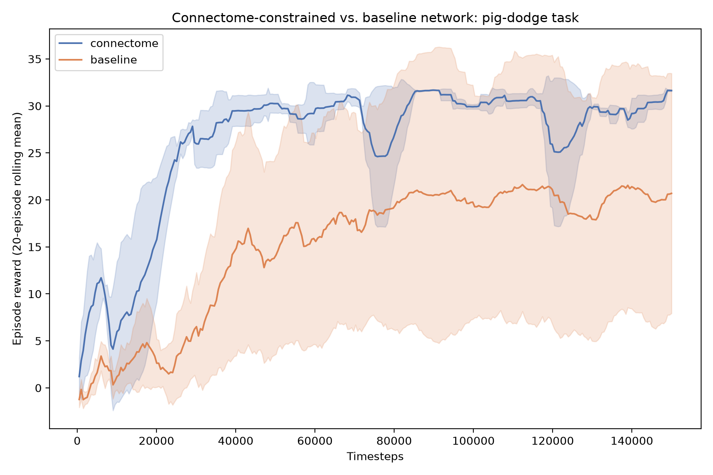
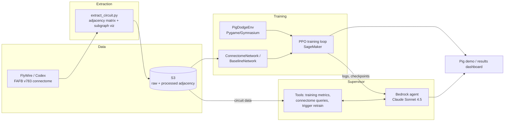

# PigBrain

A reinforcement learning agent whose neural network topology is built from a
real, published circuit in the female fruit fly connectome ([FlyWire](https://flywire.ai/),
FAFB v783), trained via PPO on a toy 2D dodging task, visualized as a pig
sprite. A Bedrock agent supervises training and can answer questions about
the underlying biology.

## Hypothesis

Does a network shaped like a real fly visual/optomotor circuit (T4/T5 →
HS/VS → descending neurons) learn a simple steering task faster or better
than a same-sized, same-edge-count, randomly-rewired network?

## Result (honest, up front)

On a pig-dodge task where a ball is thrown at the pig, the
connectome-constrained network **learned ~1.7× faster** than a size- and
edge-matched random network (rolling reward ≥ 25 by ~22–27k timesteps vs.
~39–43k) and **converged on 3/3 seeds** where the baseline converged on 2/3.
Final reward: connectome 31.6 ± 0.1 vs. baseline 20.7 ± 15.6 (the baseline's
spread is almost entirely its one failed seed). That said:

- Among runs that *did* converge, final performance is similar (~30 vs ~31.6)
  and both ended up with essentially the same "always move away" policy.
- **3 seeds is limited statistical power.** "3/3 vs 2/3 seeds" could be luck.
- The connectome network also inherits real synapse counts as initial
  weights, so this tests topology+initialization together, not topology alone.
- **v1 of this experiment was flawed and is kept for transparency:** with
  uniformly random ball spawns, every trained pig learned to hide in a corner
  instead of dodging. The task was fixed and everything re-run.

Full writeup, including the v1 → v2 story: [`results/PHASE3_RESULTS.md`](results/PHASE3_RESULTS.md).

**The RL agent is the part that is genuinely self-learning.** The Bedrock
layer described below is an automated training *supervisor* — it makes
decisions about the training process by calling tools that read real data,
but it does not itself learn over time.

## Visuals

| Circuit topology | Reward comparison |
|---|---|
|  |  |

| Untrained pig (random policy) | Trained pig (connectome-constrained) |
|---|---|
|  |  |

**Bonus: the real circuit in 3D.** Rendered from the actual FlyWire neuron
skeletons (not an abstract graph) — 631 real T4/T5, HS/VS, and DN neurons
from our extracted circuit, colored by role:

## Architecture

| Component | Service |
|---|---|
| Raw + processed connectome data | S3 |
| Circuit topology extraction | [`scripts/extract_circuit.py`](scripts/extract_circuit.py) |
| RL training (pig environment) | SageMaker ([`oink/train.py`](oink/train.py)) |
| Training supervisor / Q&A agent | Bedrock ([`oink/supervisor/`](oink/supervisor/)) |

## Method

1. **Phase 1 — Extraction:** pulled the optomotor circuit (T4/T5 motion
   detectors → HS/VS tangential cells → descending neurons) from FlyWire,
   built a signed, weighted adjacency matrix from synapse tables.
2. **Phase 2 — Environment + networks:** built a Pygame/Gymnasium pig-dodge
   environment; built a PyTorch network whose weights are masked to the real
   synaptic topology (`ConnectomeNetwork`), and a size-and-edge-matched
   randomly-rewired control (`BaselineNetwork`).
3. **Phase 3 — Experiment:** trained both variants with PPO across 3 seeds
   at 150,000 timesteps each, compared final reward, sample efficiency and
   reliability. Caught and fixed a task flaw (corner-camping) and re-ran.
4. **Phase 4 — Supervisor:** a Bedrock agent (Claude Sonnet 4.5) with tools
   to read real training logs, query the connectome graph, and trigger new
   training runs — verified live end-to-end.

See [`PLAN.md`](PLAN.md) for the full phase-by-phase plan.

## Repo layout

- `scripts/extract_circuit.py` — Phase 1 connectome extraction
- `oink/env.py` — pig-dodge Gymnasium environment
- `oink/network.py` — connectome-constrained and baseline networks
- `oink/train.py` — PPO training entrypoint
- `oink/supervisor/` — Bedrock training-supervisor agent and tools
- `scripts/compare_results.py` — Phase 3 comparison plots/summary
- `results/PHASE3_RESULTS.md` — full results writeup
- `data/processed/` — extracted circuit, trained models, plots, GIFs
